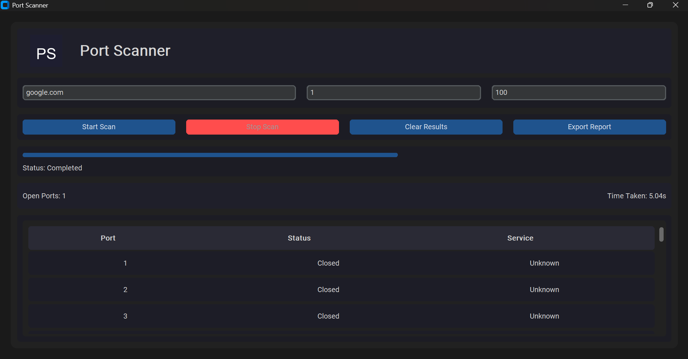
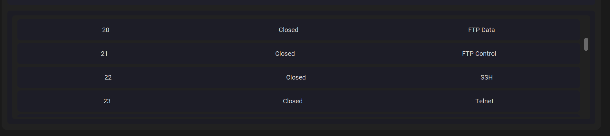

# Port Scanner

## Project Overview

Port Scanner is a professional desktop application built with Python and CustomTkinter for authorized network security testing and educational use. It provides a modern dark-themed interface, fast TCP port scanning, scan history storage, and report export for both TXT and CSV formats.

## Features

- Modern dark-themed GUI using CustomTkinter
- Target host input accepts IP addresses and domain names
- Configurable port range scanning
- Multithreaded scanning for speed
- Live progress updates and responsive GUI
- Open/Closed port detection with common service names
- Ability to stop scans gracefully
- Save completed scans to SQLite history
- Export reports to TXT and CSV

## Screenshots






## Installation

1. Ensure you have Python 3 installed.
2. Install required dependencies:

```bash
pip install -r requirements.txt
```

## Usage

1. Run the application:

```bash
python main.py
```

2. Enter a target IP address or domain name.
3. Define the start and end port range.
4. Click **Start Scan**.
5. Use **Stop Scan** to interrupt the scan early.
6. Use **Export Report** to save current scan results.

## Technologies Used

- Python 3
- CustomTkinter
- Socket programming
- ThreadPoolExecutor for multithreading
- SQLite for scan history storage
- CSV and TXT report generation
- Pillow for icon support placeholder

## Folder Structure

- `main.py` - Launches the app
- `ui.py` - GUI and user interaction logic
- `scanner.py` - Port scanning engine
- `services.py` - Common port service mapping
- `database.py` - SQLite persistence
- `report.py` - CSV and TXT report generation
- `utils.py` - Utility helpers
- `assets/` - Placeholder for logo or icons
- `reports/` - Default location for exported reports
- `database/` - SQLite database storage

## Future Enhancements

- Add scan history viewer inside app
- Include UDP scanning modes
- Add vulnerability database integration
- Add custom timeout and thread count settings
- Support export to HTML or PDF

## Legal and Ethical Disclaimer

This tool is intended for authorized network security testing, educational purposes, and auditing only. Do not scan networks or devices without explicit permission. The author is not responsible for misuse of this application.
